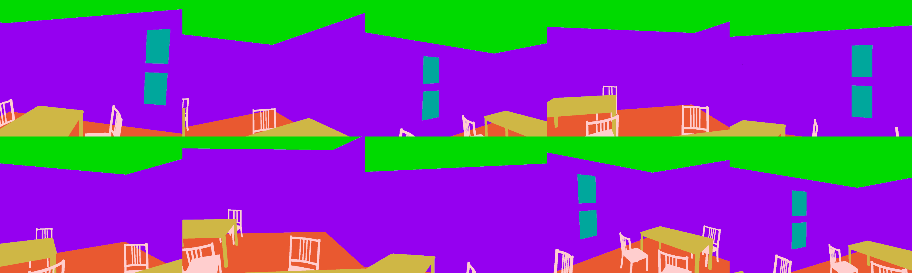

#SceneNet

All the necessary source code for SceneNet  [SceneNet: Understanding Real World Indoor Scenes with Synthetic Data](http://arxiv.org/abs/1511.07041) will be available here soon.

#Updates

This code enables depth and annotation rendering given a 3D model and trajectory. We provide a sample 3D model in the **data** folder and a trajectory in **data/room_89_simple_data** folder. More details will be updated soon. Things to do 

- [ ] Simulated Annealing
- [ ] [RGB Rendering](https://github.com/ankurhanda/SceneGraphRendering) to be merged with the code
- [ ] Releasing Trajectories
- [ ] Converting Depth to DHA format
- [ ] Emphasise on Negative Focal Length

#Dependencies

[Pangolin] (https://github.com/ankurhanda/Pangolin-local) Local copy of https://github.com/stevenlovegrove/Pangolin 

[CVD](https://github.com/ankurhanda/libcvd) (It will not be a dependency any more in future!)

[TooN](https://github.com/ankurhanda/TooN) (It will be replaced by Eigen3 in future!)

[ImageUtilities](https://github.com/ankurhanda/imageutilities)

[SceneGraphRendering](https://github.com/ankurhanda/SceneGraphRendering) (will be merged within soon!)

OpenCV/OpenCV2

libnoise (from synaptic)

#Build

```
mkdir build
cd build
cmake .. -DCUDA_PROPAGATE_HOST_FLAGS=0
make -j8
```

#Demo
in your build, run

```
./opengl_depth_rendering ../data/room_89_simple.obj
```
You should have annotated images in the folder **data/room_89_simple_data** that should look like these



#SceneNet Basis Models 

- [ ] [Bedrooms](https://bitbucket.org/robotvault/bedroomscenenet/)
- [ ] [Livingrooms](https://bitbucket.org/robotvault/livingroomsscenenet/)
- [ ] [Offices](https://bitbucket.org/robotvault/officesscenenet)
- [ ] [Kitchens](https://bitbucket.org/robotvault/bedroomscenenet/)
- [ ] [Bathrooms](https://bitbucket.org/robotvault/bedroomscenenet/)
